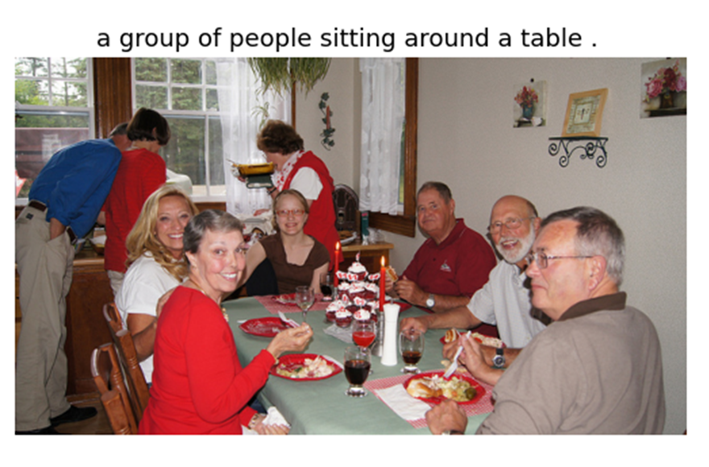

# Image-Caption-Generation
InceptionV3-Multi-layer GRU (Keras and TensorFlow)

## Requirements:

- Python 3.6
- TensorFlow 1.13.1 (Install tensorflow-1.13.1-cp36-cp36m-win_amd64.whl)
- Keras 2.2.4 
- Joblib 1.0.1
- Matplotlib 3.3.4
- Open-cv 4.5.1
- Pandas 1.1.5
- Nltk 3.5
- Download Flickr30k dataset images and captions.

## Procedure to Train Model:
1. Clone the Repository to preserve directory structure.
2. For Flickr30k put **results_20130124.token** and Flickr30k images in flickr30k-images folder.
3. Create pre-trained InceptionV3 TensorFlow graph by running: `python keras2tensorflow.py`
4. Generate features(features.npy) corresponding to the images in the dataset folder by running:
`python convfeatures.py --data_path Dataset/MSCOCO-images --inception_path ConvNets/InceptionV3_keras.pb`
5. Train the model by running: `python main.py --mode train --caption_path ./Dataset/results_20130124.token --feature_path ./Dataset/features.npy --resume`

## Procedure to Embedded Model:
1. Save both encoder and decoder graphs by running: 
`python main.py --mode test --image_path ANY_TEST_IMAGE.jpg/png --saveencoder --savedecoder`
2. Freeze encoder by running:
`python utils/save_graph.py --mode encoder --model_folder model/Encoder/`
2. Freeze decoder by running:
`python utils/save_graph.py --mode decoder --model_folder model/Decoder/`
3. Merge encoder and decoder by running:
`python utils/merge_graphs.py --encpb ./model/Trained_Graphs/encoder_frozen_model.pb --decpb ./model/Trained_Graphs/decoder_frozen_model.pb`
4. Generate **idmap** file by running:
`python utils/singleProtoBuf.py`

## Procedure to Optimization (Post-Training Quantization) Model:
`python convert_optimize.py`

## Evaluate:
`python main.py --mode eval --image_path Dataset/val2017 --inception_path ConvNets/InceptionV3_keras.pb`

## Results:
- Python code-generated captions:

- Embedded model-generated captions on the application:

